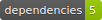

  

# 🤖💬 waar | WhatsApp Auto-Reply node cli

- Run headless (no browser UI showed) 
- Keep session stored for next uses (scan QR directly from terminal and only once)

## 📝 Installation & Usage

- `git clone https://github.com/yeikiu/waar`

- `cd waar`

- `yarn (install)`

- `yarn start` OR `npm (run) start`
