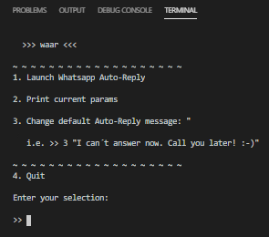

  

# 🤖💬 waar - WhatsApp AutoReply

> Auto-Reply bot for WhatsApp running on NodeJS

## 📝 Installation & Usage

    git clone https://github.com/yeikiu/waar

    cd waar

    yarn start / npm start

---

