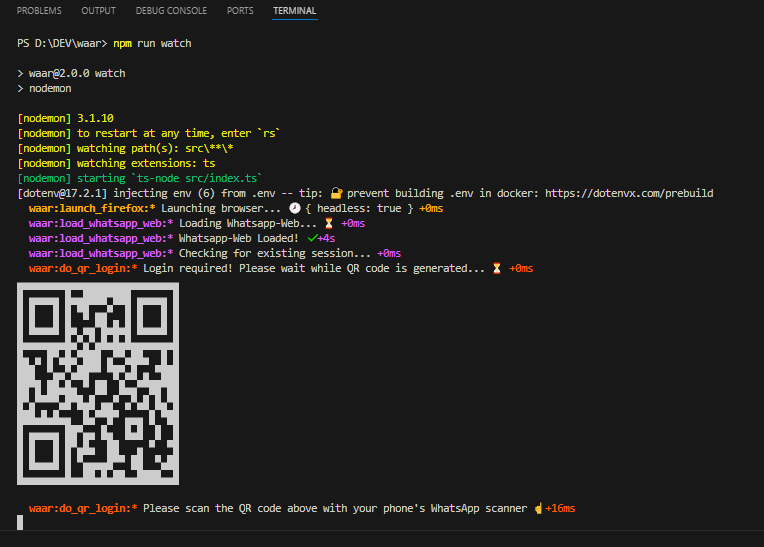
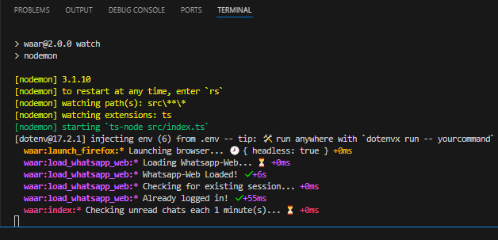

  

# 🤖💬 waar | WhatsApp Auto-Reply

- Runs headless: No browser UI window displayed. (You can change this later with `WAAR_HEADLESS` env variable) 
- Keeps session stored for next uses: Scan QR directly from terminal and only once

## Usage

- `git clone https://github.com/yeikiu/waar`
- `cd waar`
- `npm i` (install dependencies once)
- `npm run start`

## 📝 Development

- `npm run watch`
