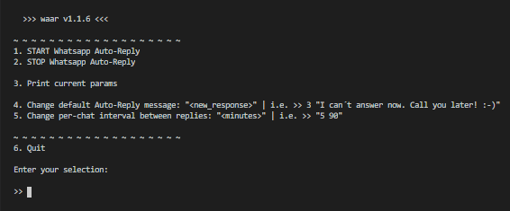

  

# 🤖💬 waar | WhatsApp Auto-Reply node cli

- Run headless: No browser UI window displayed. (You can change this later with `WAAR_HEADLESS` env variable) 
- Keep session stored for next uses: Scan QR directly from terminal and only once

## Run directly from the npm repo

- `npx waar`

## 📝 Development

- `git clone https://github.com/yeikiu/waar`

- `cd waar`

- `yarn (install dependencies once)`

- `yarn watch`

---

