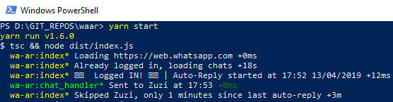

# WaAr - WhatsApp AutoReply
Auto-Reply for WhatsApp running on NodeJS

Bot is using [GoogleChrome puppeteer!](https://github.com/GoogleChrome/puppeteer) under the hood :smile:

## Features ##

- :white_check_mark: Login once and remember session
- :white_check_mark: Set message-checking interval
- :white_check_mark: Set minimun time-frame between consecutive auto-replies

## Requirements ##
- yarn OR npm
- NodeJS v8+

Tested on Windows & MacOS X + Node v8.9.1 and puppeteer v0.13.0

## Installation ##
- Install [yarn](https://yarnpkg.com/lang/en/docs/install)
- `git clone https://github.com/yeikiu/waar.git` or [download the latest .zip](https://github.com/yeikiu/waar/archive/master.zip)
- CD into dir: `cd waar`
- Get dependencies: `yarn install`

## Running the bot ##

- Finally run `yarn start` for deafult values

OR

- `yarn start -m="I'm not available at the moment. \n\nPlease try again later." --nrf=45 --ci=20 --w=true` where:
    - m = Message = Body of the programmed auto-reply. Default message within `config.js` file.
    - nrf = No Reply Frame = Time in minutes to wait before auto-replying the same conversation
    - ci = Check Interval = Time in seconds to wait before checking for new messages through your conversations
    - w = Window = Hide/Show the browser window
    - Default values: `--nrf=30 --ci=25 --w=false`

- The first time you run the bot, waWeb's QR code will appear so you can scan it and close the image once logged in. You can play with the config file to make Chrome window open up, change time intervals.

**NOTE:** Once you have connected by scanning QR code, your session will be saved so you won't have to scan it again and again unless you revoke from whatsapp app or by deleting **_tmp** folder. 

## TODO ##
- Mark each replied chat as unread
- Detect/handle group chat cells
- Detect/handle log out

## Contribute ##

You are welcome to contribute to this project.

## Disclaimer ##

This project is not affiliated with official WhatsApp in any sense.
All credits for the base code should be for [sarfraznawaz2005](https://github.com/sarfraznawaz2005/whatspup), this repo wouldn't exist without his fork.
